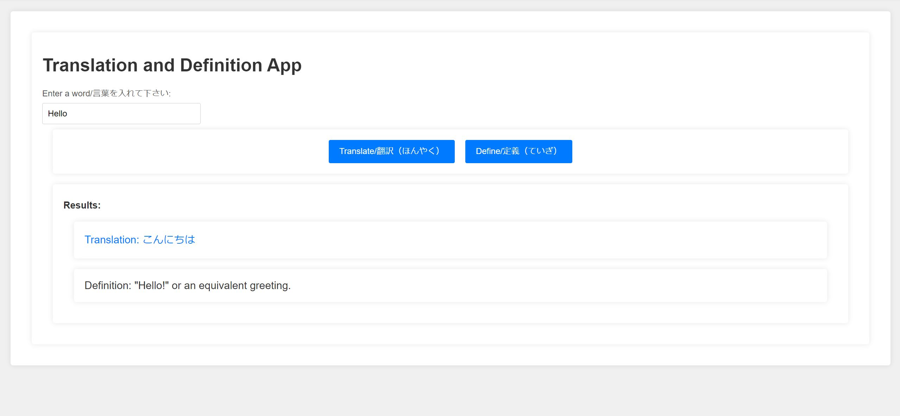

# Translation + Definition App

## Table of Contents

- [Description](#description)
- [Usage](#usage)
- [Technologies-Used](#technologies-used)
- [To-Do](#to-do)
- [Screenshots](#screenshots)
- [Link](#link)

## Description

This is an application in which the user can input any English word and get a brief definition as well as a Japanese translation.

## Usage

The user types their word of choice into the input box and clicks both or one of the provided buttons to recieve either a translation and/or a definition, depending on the button pressed.

## Technologies-Used

- Frontend:

  - JavaScript
  - CSS
  - HTML
  - This app was bootstrapped with create-react-app

- Backend:
  - Lambda Python for backend functionality
  - RESTful API Gateway for communication
  - Flask for path handling
  - Requests library for making API calls

## To-Do

- Add Japanese to English functionality
- Add definitions in Japanese
- Possibly combine functions to a single button for ease of use

## Screenshots

## Link

[Link to Translation and Definition App](https://main.d916lbd27q0kh.amplifyapp.com/)
